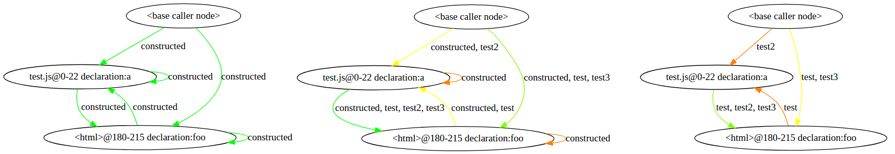

# JavaScript dead code elimination
This Node.js script analyses a web application within a directory and removes unsused functions.

```diff
- Warning: this tool re-writes files in the directory! Back up your code before running.
```


## Prerequisites
Assumes all JavaScript code in the directory it is run upon is valid (i.e. no parse errors).
Algorithms might have other requirements, as indicated below.


## Installing
```
npm install
npm --prefix ./algorithms/static install ./algorithms/static
npm --prefix ./algorithms/dynamic install ./algorithms/dynamic
npm --prefix ./algorithms/nativecalls install ./algorithms/nativecalls
npm --prefix ./algorithms/walacg install ./algorithms/walacg
```


## Running
```
node ./hybrid.js <directory> [options]
```
_directory_ is the directory the tool is run upon (mandatory); this should be a relative path. _options_ allow you to specify more settings:

| Long         | Short | Description                                             | Default             |
|--------------|-------|---------------------------------------------------------|---------------------|
| --index      | -i    | Specify the main HTML file.                             | index.html          |
| --verbose    | -v    | Show output to stdout.                                  |                     |
| --csv        | -c    | Enable output to CSV file in addition to stdout.        |                     |
| --csvfile    | -f    | Specify CSV file to append data to (only with --csv).   | output.csv          |
| --graph      | -g    | Enable function graph output.                           |                     |
| --graphfile  | -d    | Specify graph (DOT) output location (only with --graph) | output.dot          |
| --algorithm  | -a    | Specify algorithms (multiple allowed, space separated). |                     |
| --entire     | -e    | Output disconnected nodes in graph (only with --graph). |                     |
| --noremove   | -n    | Don't remove uncalled nodes.                            |                     |
| --timeout    | -t    | Pass a timeout value to algorithms (not enforced).      |                     |
| --pace       | -p    | Display when an algorithm starts running                |                     |


The following algorithms are available by default:

| Name         | Description                                                    | Additional requirements                                  |
|--------------|----------------------------------------------------------------|----------------------------------------------------------|
| static       | Static analysis                                                |                                                          |
| dynamic      | Dynamic analysis                                               | Valid <head> tag in HTML                                 |
| random       | Marks random functions                                         |                                                          |
| nativecalls  | Marks inline function expression arguments in native functions |                                                          |
| walacg       | WALA JS callgraph                                              | `java` installed, all <script> tags should be JavaScript |


The csv file has the following columns:
```
directory name, JS files processed, # functions, # functions removed, run time (in ms), error messages
```

The graph file is outputted in DOT format, which you can visualize online [here](http://www.webgraphviz.com/) or on the command line with `dot` (e.g. `dot -Tpng output.dot -o output.png`).


### Example
Directory _foo_ with index file _app.html_, appending result data to _bar.csv_, with the static and dynamic algorithms:
```
node hybrid.js foo --index app.html --csv --csvfile bar.csv --algorithm static dynamic
```


## How does it work?
Because no single analysis tool can ever be certain it found the complete call graph, we start out with a complete digraph (i.e. all nodes (functions) are connected).
Each analysis tool ('algorithm') is allowed to mark edges. In the end, all unmarked edges are removed.




## Extending
You can add custom algorithms by writing an adapter.
For more information, see the [`example` adapter source](algorithms/example.js). The adapter file should be placed in the `algorithms` folder.
To prevent collisions, any dependencies should be placed in a folder with the same name, e.g. for the algorithm `example`, place dependencies in `algorithms/example/`.
Then, use the --algorithm flag to specify the new algorithm.

Algorithms should only mark edges (with the provided `find_node` and `mark` functions), and not modify the files or nodes (graph) in any other way.


## Attributions
This project heavily relies on code from several other projects:

+ [abort/javascript-call-graph](https://github.com/abort/javascript-call-graph/) - `static` and `nativecalls` algorithms
+ [wala/WALA](https://github.com/wala/WALA/) - `walacg` algorithm (source can be found [here](../WalaCG/WalaCG.java))

More information on other used packages and libraries can be found in the `package.json` files in the project.
